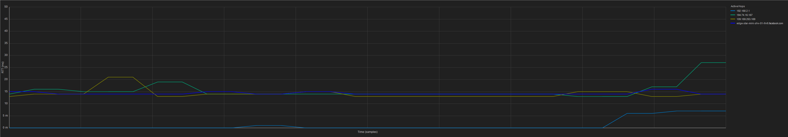

WinMTR Graph
==============
**WinMTR Graph** is a fork of [WinMTR (Redux)](https://github.com/White-Tiger/WinMTR) which itself is a fork of [Appnor's WinMTR](http://winmtr.net/) ([sourceforge](http://sourceforge.net/projects/winmtr/)).  
It adds graph visualization to WinMTR.  

### Download (binaries)
* [**view all available**](https://github.com/codename-B/WinMTRGraph/releases)

#### New Graph Features
- `[x]` **Real-time RTT graph visualization** - Modern PingPlotter-style graph with colored lines per hop
- `[x]` **Copy graph to clipboard** - Export graph as bitmap for sharing
- `[x]` **Export to PNG** - Save graphs for documentation
- `[x]` **Configurable time range** - View 30s to 1 hour of history
- `[x]` **Single-hop selection** - Focus on specific hops for detailed analysis
- `[x]` **Auto-scaling** - Graph automatically adjusts to RTT values

#### Differences to [WinMTR](http://winmtr.net/) 0.98
- `[x]` - removed Windows 2000 support  
- `[x]` + added IPv6 support  
- `[x]` + clickable entries when stopped.. *(why the heck wasn't it possible before?)*  
- `[x]` * added start delay of about 30ms for each hop *(870ms before the 30th hop gets queried)  
this should improve performance and reduces network load*  
- `[x]` ! fixed trace list freeze *(list didn't update while tracing, happens when tracing just one hop)*  
- `[x]` * theme support *(more fancy look :P)*  
- `[x]` * new icon  
- `[ ]` ! CTRL+A works for host input  
- `[ ]` + host history: pressing del key or right mouse will remove selected entry  

### Requirements
* Windows Vista+ (Windows 10/11 recommended)
* Microsoft Visual C++ Redistributables (2015-2022)

### Building from Source
* Visual Studio 2022 with C++ desktop development workload
* Open `WinMTRGraph.sln` and build
* Supports x86 and x64, Debug and Release configurations

For automated releases, see [RELEASE.md](RELEASE.md)
